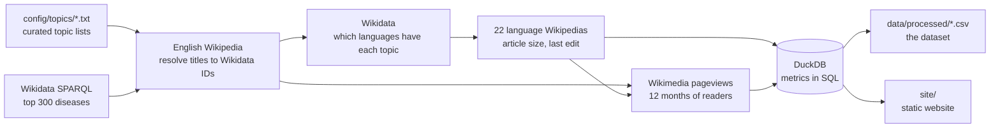

# BhashaGap: India's Language Knowledge Gap

**How much of what you need to know exists in your language?**

Around a billion Indians would rather read in their own language than in English. But look up *dengue*, *crop insurance* or the *Right to Information Act* on Wikipedia in Marathi, Odia or Santali, and the article is often missing, a few lines long, or years out of date.

BhashaGap measures that gap. For several hundred everyday topics (health, farming, government schemes and rights, science, money), it checks **22 Indian-language Wikipedias** and asks three questions:

1. **Does an article exist?**
2. **How complete is it**, compared with the English article?
3. **How much do people want to read it?** (12 months of page views)

It then turns the answers into a **Knowledge Access Score** for each language, a map of where the gaps are, and a **"write these first" list** for each language: missing articles and stubs, most-read topics first. Volunteers who write for Indian-language Wikipedias can start from these lists.

> Screenshot: add one of your real dashboard here after your first run (`docs/screenshot.png`).

---

## How it works



| Step | API | What it gives |
|---|---|---|
| Topics | Curated lists + **Wikidata SPARQL** | ~540 topics, each with a Wikidata ID |
| Coverage | **Wikidata** `wbgetentities` | Which of the 22 languages has an article on each topic |
| Articles | **MediaWiki Action API** on each wiki | Article size and last edit date |
| Readable text | **TextExtracts** (MediaWiki) | Characters of plain text readers actually see, for every article |
| Demand | **Wikimedia REST pageviews** | 12 months of human (non-bot) views |
| Metrics | **DuckDB (SQL)** | Scores, gaps and priority lists (`bhashagap/metrics.sql`) |

Engineering details worth knowing:
- **Polite, resumable collection.** Every API response is cached on disk, requests are rate-limited (8/second by default), and 429/5xx errors are retried with backoff. If a run stops halfway, run it again and it continues from the cache. A repeat run takes seconds.
- **Batching.** Titles and IDs are sent 50 per request (the API maximum), so the ~12,000 topic-language checks take a few hundred requests. Page views need one request per article and run in parallel.
- **Redirects and merged items are handled.** For example, "Dengue" redirects to "Dengue fever", and when a Wikidata item has been merged into another, the answer comes back under a different ID and is mapped back.
- **Fair size comparison across scripts.** Articles are compared by their *readable text* (plain text without references, templates or formatting code), not by byte size. Byte size is misleading for Indian languages: the text takes about 3 bytes per letter in UTF-8, but the surrounding wiki code is 1-byte ASCII, so no single conversion factor works. The first version used bytes ÷ 3, which systematically underestimated every Indian language. Byte size is now only a fallback when the text can't be fetched.

## The metrics (defined in `bhashagap/metrics.sql`)

| Metric | Meaning |
|---|---|
| **depth** | Characters of readable text in the language article ÷ readable text in the English article, capped at 1 |
| **status** | `missing`, `stub` (depth < 0.15), `partial` (0.15–0.5) or `good` (≥ 0.5) |
| **coverage** | Share of topics with any article |
| **Knowledge Access Score** | Demand-weighted average depth over all topics, with missing articles counting as 0. In words: *if a reader of this language looked up the topics people actually read, what share of the English content would they find?* 100 = as good as English. |
| **speakers per article** | First-language speakers (Census 2011, approximate) ÷ existing articles |
| **priorities** | Missing articles and stubs, ranked by English page views |

**Limitations.** Length is only a rough stand-in for quality: a long article can be out of date, and a short one can be excellent. English page views reflect readers worldwide, not only in India. Speaker figures are approximate, and the Census counts Bhojpuri speakers under Hindi.

---

## The dataset (`data/processed/`)

| File | One row per | Key columns |
|---|---|---|
| `language_scores.csv` | language | coverage, demand_coverage, depth_of_present, fresh_share, access_score, speakers_per_article |
| `category_scores.csv` | language × area | coverage, access_score |
| `coverage.csv` | topic × language | status, local title, length_bytes, depth, last_edit, en_views, lang_views |
| `priorities.csv` | language × rank (top 100) | en_title, status, existing_title, en_views |
| `topics.csv` | topic | Wikidata ID, English title, areas, 12-month English views |
| `unresolved_titles.csv` | topic list entry | titles in `config/topics` that weren't found (fix or remove them) |

Sources: Wikidata (CC0) and Wikipedia / Wikimedia pageviews (CC BY-SA).

---

## Run it on your Mac

You need **Python 3.10+** (`python3 --version`) and an internet connection.

```bash
cd bhashagap
python3 -m venv .venv
source .venv/bin/activate
pip install -r requirements.txt

python -m pytest -q                               # 14 tests, no internet needed
python -m bhashagap run --limit 5 --langs hi,mr   # 1-minute test run
python -m bhashagap run                           # the full run: ~20-30 min the first time
```

At the end of the full run it prints the score for every language, and writes the dataset to `data/processed/` and the website data to `site/data/`.

To open the website:

```bash
python3 -m http.server 8000 -d site
```

Then go to **http://localhost:8000**. Opening `index.html` directly from Finder won't work, because browsers block loading the data files from the file system.

Other commands:

```bash
python -m bhashagap run --langs hi,bn,ta   # only some languages
python -m bhashagap run --no-pageviews     # much faster, but no demand weighting
python -m bhashagap export                 # rebuild CSV/JSON from the database
python -m bhashagap demo                   # random demo data (shows a banner on the site)
```

**Add topics:** add English Wikipedia titles to any file in `config/topics/`, or create a new `.txt` file for a new area. **Add a language:** add a row to `config/languages.csv`.

## Publish it (GitHub Pages)

1. Push the repo to GitHub.
2. In the repo, go to **Settings → Pages → Source** and choose **GitHub Actions**.
3. In the **Actions** tab, run **Monthly refresh** once by hand.

The workflow re-measures everything on the 2nd of every month, commits the new dataset, and republishes the site. It also keeps a month-by-month history of the gap.

## Project structure

```
bhashagap/
├── bhashagap/
│   ├── http.py         polite HTTP client: cache, rate limit, retries
│   ├── wikimedia.py    SPARQL, MediaWiki, Wikidata and pageviews API calls
│   ├── collect.py      the 4 collection steps
│   ├── store.py        loads everything into DuckDB
│   ├── metrics.sql     every metric, in SQL
│   ├── export.py       CSV dataset + website JSON
│   ├── demo.py         random demo data
│   └── __main__.py     command line
├── config/             languages.csv, topics/*.txt, sparql/diseases.rq
├── data/processed/     the dataset (CSV)
├── site/               the website (HTML/CSS/JS, no framework)
├── tests/              pytest, with a fake Wikimedia that answers like the real APIs
└── .github/workflows/  monthly refresh + GitHub Pages
```
